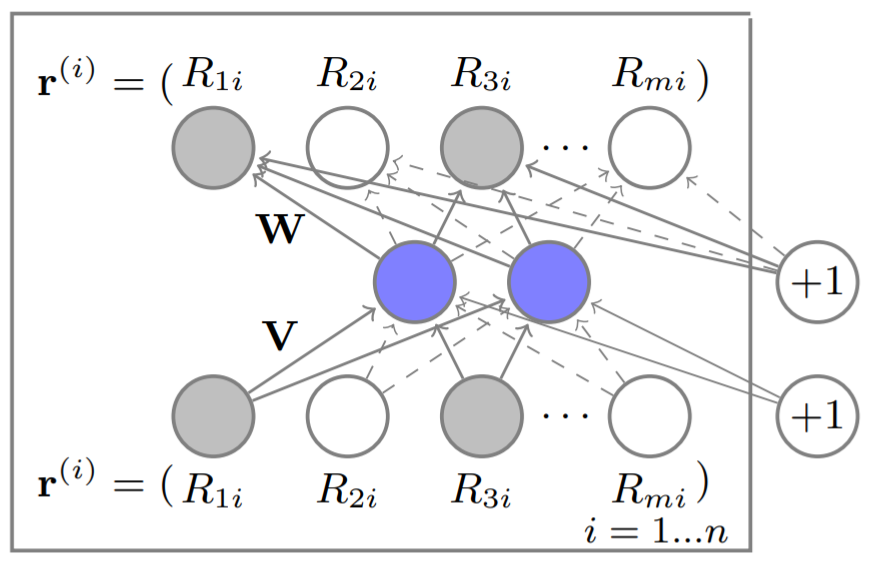

In this review, we covered the AutoRec: ['Autoencoders Meet Collaborative Filtering'](https://dl.acm.org/doi/pdf/10.1145/2740908.2742726) Paper
  
  
## Summery 
We started by choosing matrix factorization as our baseline model. Following that, we implemented the AutoRec model as suggested in the paper, and then suggested an improvement to it.
The suggestion was to add a dropout to the encoding layer. By adding the dropout, we anticipated that the model would be more generalized, prevent overfitting, and perform better on the validation set.
As in the paper, we used the RMSE metric as a comparison metric.
On the "movielens100k" dataset, we tested the models and found the best hyperparameters. Then we applied those parameters to the "movielens 1M" dataset.
The AutoRec model outperformed the matrix factorization, and our model achieved even better results than both.

## How to run:
Follow the `report.ipynb` file or open the `report.html` to only see resultes.
 **Note** The environment that used to run this repo is in the `environment.yml` file. 
